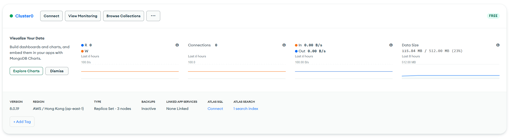
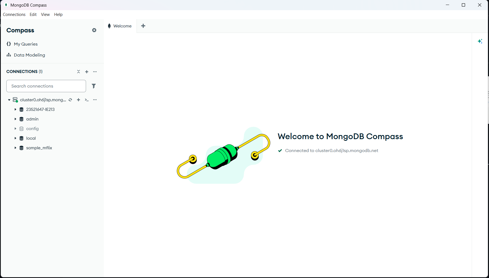
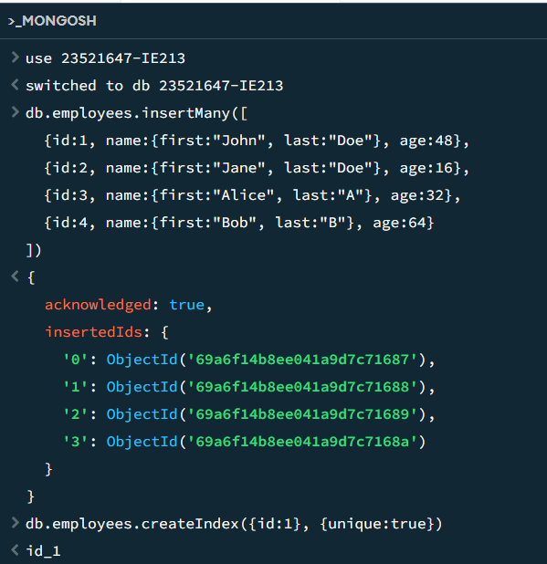
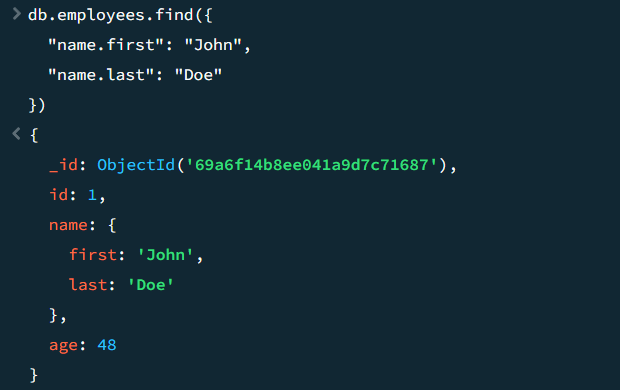
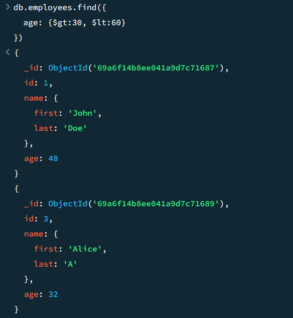
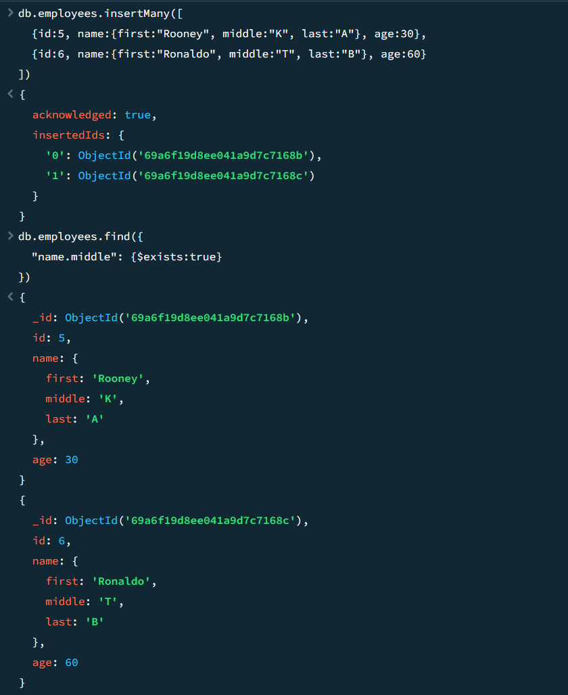
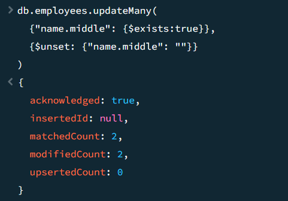
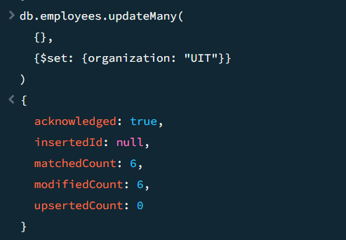
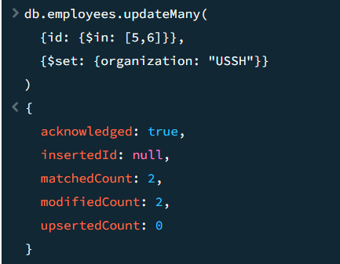
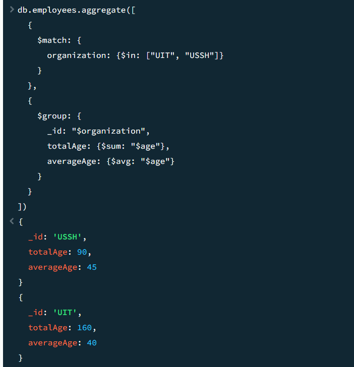

# Lab 01 - MongoDB CRUD Operations

## Thông tin sinh viên

| Mục | Nội dung |
| --- | --- |
| Họ và tên | Phan Hữu Trí |
| MSSV | 23521647 |
| Môn học | IE213.Q21 - Kỹ thuật phát triển hệ thống web|

## Bài 1. Thiết lập môi trường

### 1.1 Cloud MongoDB


### 1.2 Kết nối MongoDB Compass


## Bài 2. Thực hành CRUD

### 2.1 Tạo cơ sở dữ liệu `23521647-IE213`
```javascript
use 23521647-IE213
```

### 2.2 Thêm document vào collection `employees`
```javascript
db.employees.insertMany([
  { id: 1, name: { first: "John", last: "Doe" }, age: 48 },
  { id: 2, name: { first: "Jane", last: "Doe" }, age: 16 },
  { id: 3, name: { first: "Alice", last: "A" }, age: 32 },
  { id: 4, name: { first: "Bob", last: "B" }, age: 64 }
])
```

### 2.3 Đặt `id` là duy nhất
```javascript
db.employees.createIndex({ id: 1 }, { unique: true })
```


### 2.4 Tìm nhân viên có họ tên John Doe
```javascript
db.employees.find({
  "name.first": "John",
  "name.last": "Doe"
})
```


### 2.5 Tìm những người có tuổi > 30 và < 60
```javascript
db.employees.find({
  age: { $gt: 30, $lt: 60 }
})
```


### 2.6 Thêm 2 document mới và kiểm tra `middle name`
```javascript
db.employees.insertMany([
  { id: 5, name: { first: "Rooney", middle: "K", last: "A" }, age: 30 },
  { id: 6, name: { first: "Ronaldo", middle: "T", last: "B" }, age: 60 }
])

db.employees.find({
  "name.middle": { $exists: true }
})
```


### 2.7 Xóa trường `middle name`
```javascript
db.employees.updateMany(
  { "name.middle": { $exists: true } },
  { $unset: { "name.middle": "" } }
)
```


### 2.8 Thêm trường `organization: "UIT"` cho tất cả document
```javascript
db.employees.updateMany(
  {},
  { $set: { organization: "UIT" } }
)
```


### 2.9 Cập nhật organization của `id = 5, 6` thành `USSH`
```javascript
db.employees.updateMany(
  { id: { $in: [5, 6] } },
  { $set: { organization: "USSH" } }
)
```


### 2.10 Tính tổng tuổi và tuổi trung bình theo organization
```javascript
db.employees.aggregate([
  {
    $match: {
      organization: { $in: ["UIT", "USSH"] }
    }
  },
  {
    $group: {
      _id: "$organization",
      totalAge: { $sum: "$age" },
      averageAge: { $avg: "$age" }
    }
  }
])
```

