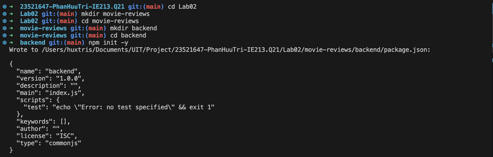
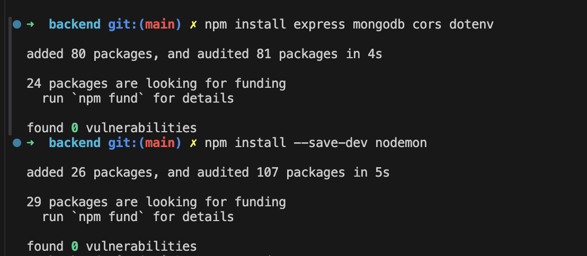
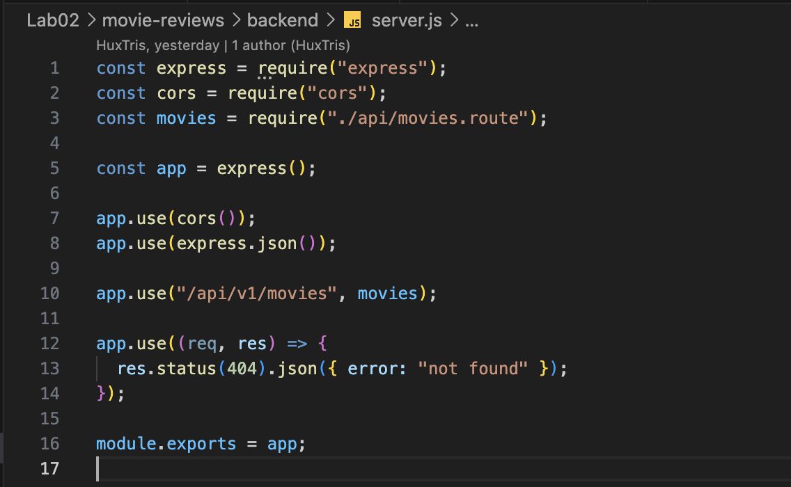
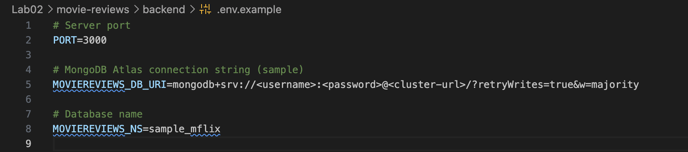
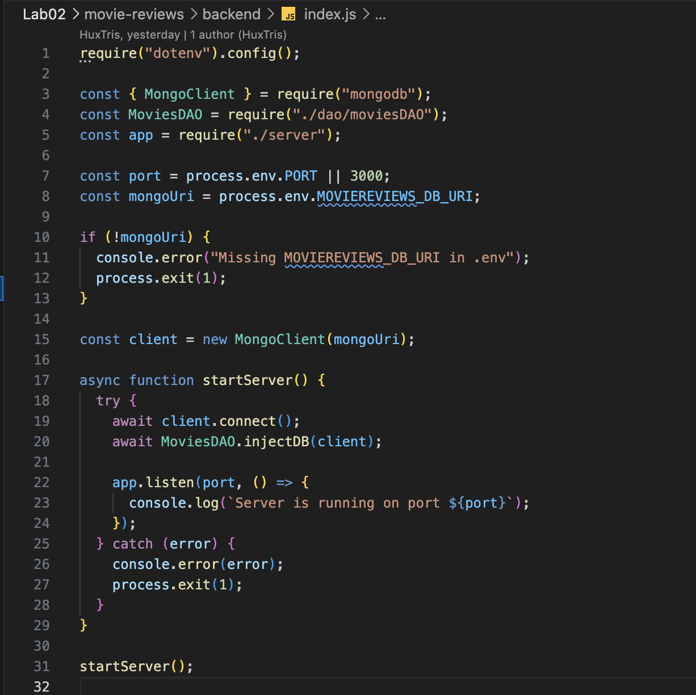
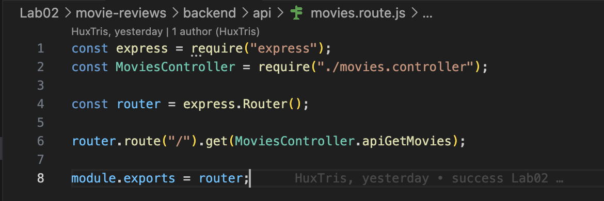
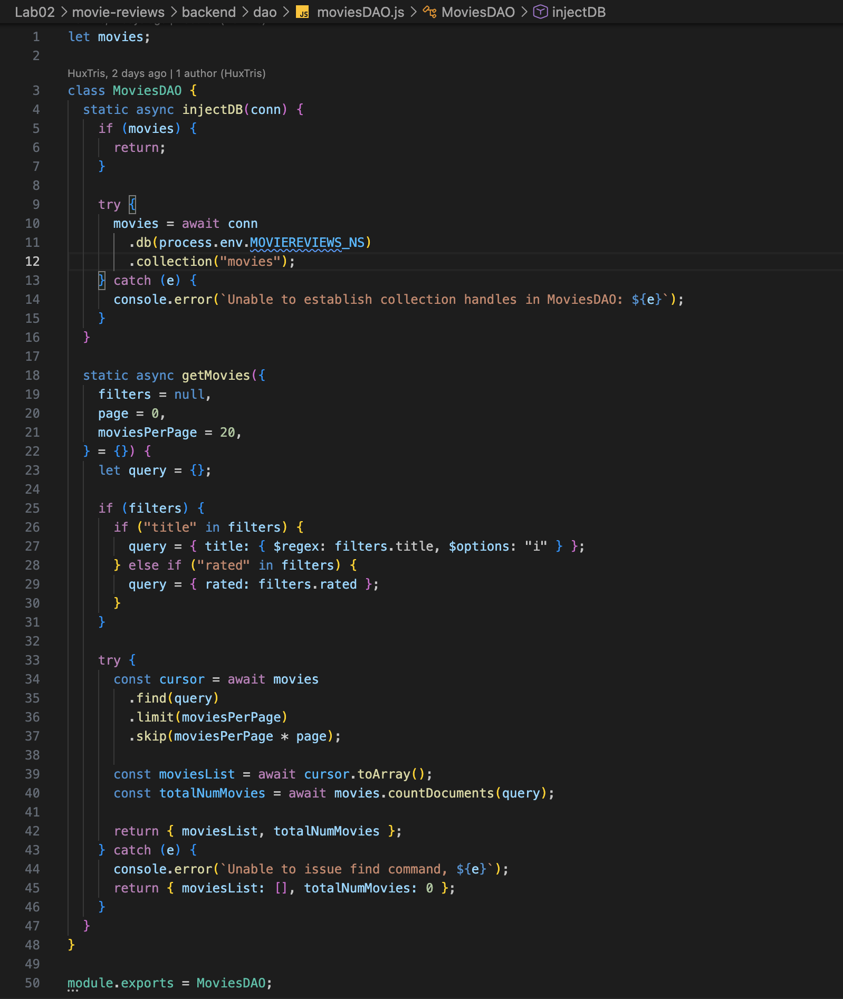
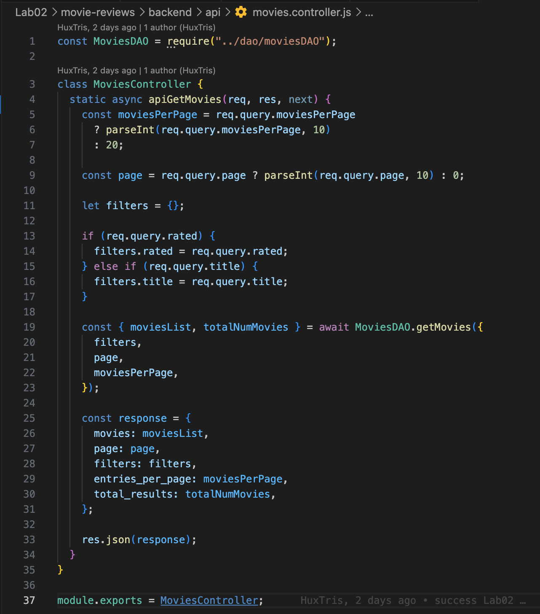
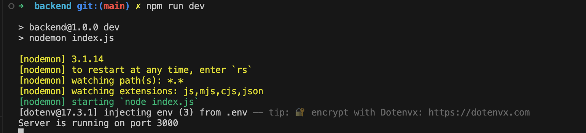
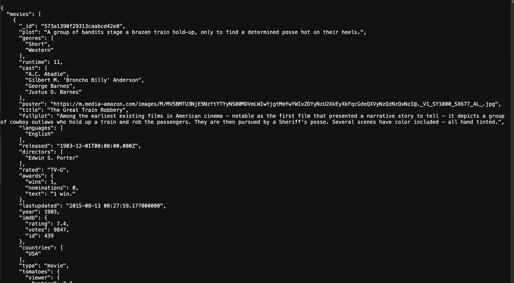

# LAB 02 - Movie Reviews Backend

## 1. Thông Tin Báo Cáo
- Môn học: Kỹ thuật phát triển hệ thống web
- Bài thực hành: Lab 02 - Xây dựng backend Movie Reviews
- Sinh viên: Phan Hữu Trí
- MSSV: 23521647
- Lớp: IE213.Q21
- GVHD: ThS. Võ Tấn Khoa

## 2. Mục Tiêu Bài Lab
- Cài đặt môi trường Node.js cho backend
- Xây dựng API cơ bản với Express
- Kết nối MongoDB Atlas
- Truy xuất dữ liệu từ collection `movies`
- Áp dụng mô hình Route -> Controller -> DAO


## 3. Cấu Trúc Thư Mục
```text
Lab02/
├── README.md
└── movie-reviews/
    └── backend/
        ├── .env
        ├── index.js
        ├── server.js
        ├── package.json
        ├── api/
        │   ├── movies.route.js
        │   └── movies.controller.js
        └── dao/
            └── moviesDAO.js
```

## 5. Hướng Dẫn Chạy Dự Án

### 5.1 Cài đặt dependencies
```bash
cd movie-reviews/backend
npm install
```

### 5.2 Cấu hình biến môi trường
Tạo file `.env`:

```env
PORT=3000
MOVIEREVIEWS_DB_URI=<YOUR_MONGODB_ATLAS_URI>
MOVIEREVIEWS_NS=sample_mflix
```

### 5.3 Chạy server
```bash
npm run dev
```

### 5.4 Kiểm tra API
```bash
curl http://localhost:3000/api/v1/movies
```

Hoặc mở trình duyệt:

```text
http://localhost:3000/api/v1/movies
```

## 6. Quá trình thực hiện

### Bài 1: Thiết lập môi trường

#### 1.3 Tạo cấu trúc thư mục
```bash
mkdir -p movie-reviews/backend
```

#### 1.4 Khởi tạo project
```bash
npm init -y
```

- 

#### 1.5 Cài dependencies
```bash
npm install mongodb express cors dotenv
```
#### 1.6 Cài nodemon
```bash
npm install --save-dev nodemon
```

```json
"scripts": {
  "start": "node index.js",
  "dev": "nodemon index.js"
}
```



### 🔹 Bài 2: Xây dựng backend

#### 2.1 `server.js`
- Khởi tạo Express
- Middleware: CORS, JSON
- Route `/api/v1/movies`
- Xử lý 404
- 

#### 2.2 `.env.example`
- PORT
- DB URI
- Database name
- 

#### 2.3 `index.js`
- Kết nối MongoDB Atlas
- Gọi DAO
- Khởi động server
- 

#### 2.4 Route
- `/api/v1/movies`
- 

#### 2.5 DAO
- `injectDB()`
- `getMovies()`
- 

#### 2.6 Controller
- Nhận request
- Gọi DAO
- Trả JSON
- 

## 7. Kết Quả Chạy

### Chạy server
```bash
npm run dev
```


### Kết quả
- Server chạy tại `http://localhost:3000/api/v1/movies`
- API trả về JSON danh sách phim
- 
  