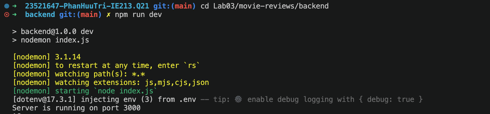
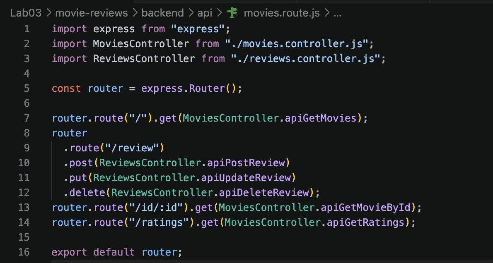
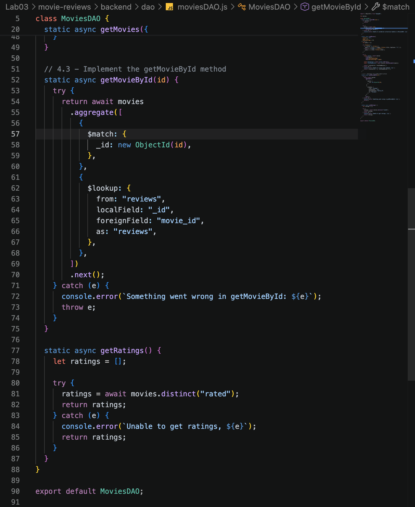
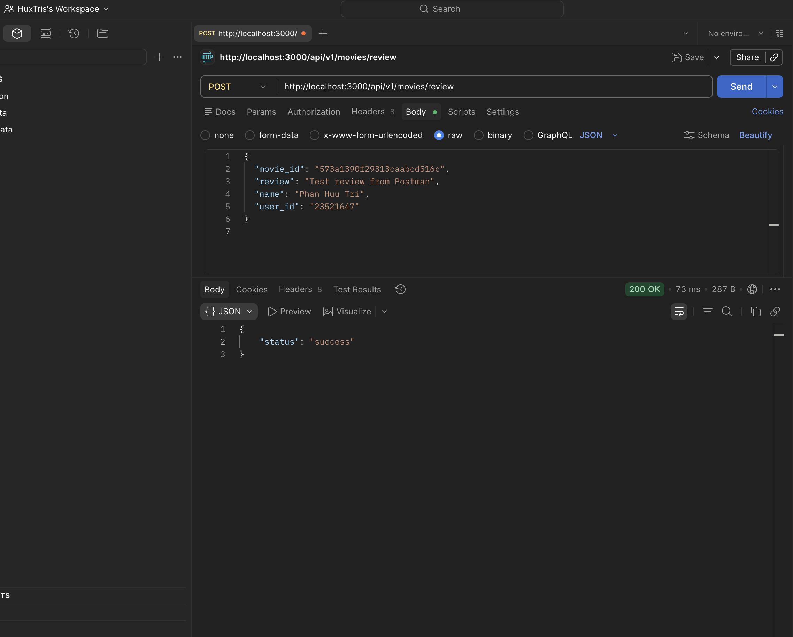
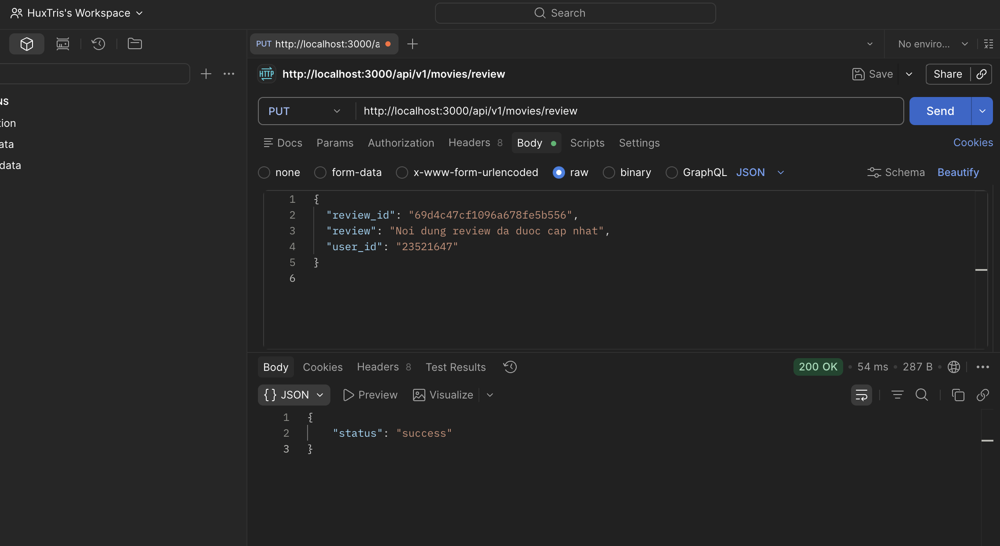
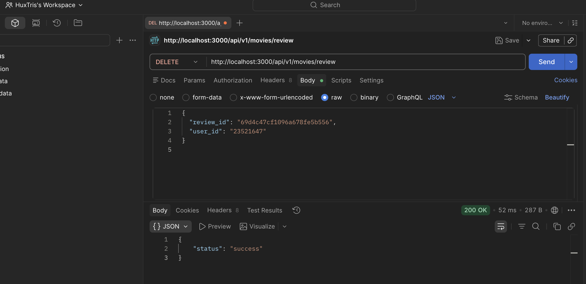
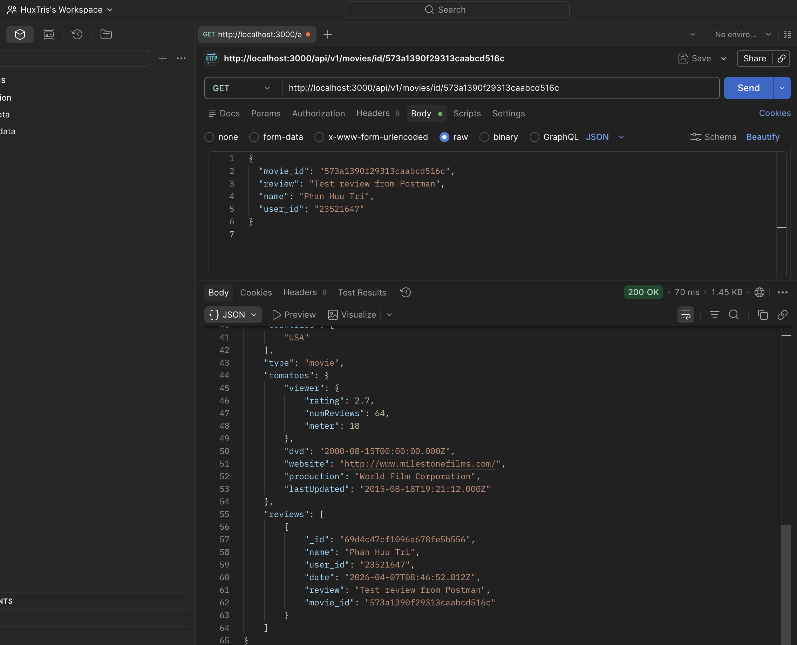
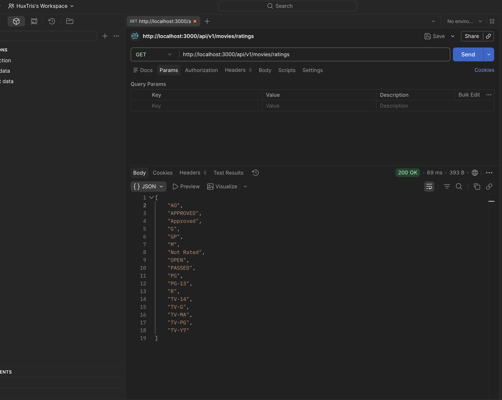

# LAB 03 - Hoàn thiện Backend cho ứng dụng Movie Reviews

## 1. Thông tin báo cáo
- Môn học: Kỹ thuật phát triển hệ thống web
- Bài thực hành: Lab 03
- Sinh viên: Phan Hữu Trí
- MSSV: 23521647
- Lớp: IE213.Q21
- Giảng viên hướng dẫn: ThS. Võ Tấn Khoa

## 2. Mục tiêu bài lab
Bài Lab 03 tập trung mở rộng backend đã xây dựng ở `Lab02` để hoàn thiện thêm các chức năng thao tác với `review` và bổ sung một số API phục vụ ứng dụng Movie Reviews.

Sau khi hoàn thành, hệ thống đạt được các yêu cầu chính sau:
- Quản lý `review` thông qua các API `POST`, `PUT`, `DELETE`
- Lấy thông tin phim theo `id` kèm danh sách review liên quan
- Lấy danh sách các giá trị `rated` trong dữ liệu phim
- Duy trì khả năng kết nối MongoDB Atlas và truy xuất dữ liệu từ `sample_mflix`

## 3. Công nghệ sử dụng
- Node.js
- Express.js
- MongoDB Atlas
- MongoDB Node.js Driver
- dotenv
- cors
- nodemon
- ESM modules
- Postman để kiểm thử API

## 4. Hướng dẫn cài đặt và chạy dự án
Di chuyển vào thư mục backend:

```bash
cd Lab03/movie-reviews/backend
```

Cài đặt dependencies:

```bash
npm install
```

Tạo file `.env` từ `.env.example` và điền thông tin kết nối MongoDB Atlas:

```env
PORT=3000
MOVIEREVIEWS_DB_URI=<YOUR_MONGODB_ATLAS_URI>
MOVIEREVIEWS_NS=sample_mflix
```

Khởi động server:

```bash
npm run dev
```

Nếu thành công, terminal sẽ hiển thị thông báo:

```text
Server is running on port 3000
```

Ảnh minh họa:


## 5. Quá trình thực hiện

### 5.1 Khởi tạo từ base Lab02
Project `Lab03` được tạo riêng, không chỉnh sửa trực tiếp trên `Lab02`. Phần backend của `Lab02` được dùng làm base, sau đó mở rộng thêm các chức năng mới theo hướng dẫn của thầy.

### 5.2 Bổ sung API cho review
Project được bổ sung các endpoint để quản lý review:
- `POST /api/v1/movies/review`
- `PUT /api/v1/movies/review`
- `DELETE /api/v1/movies/review`

Phần route được nối với `ReviewsController`, và controller tiếp tục gọi xuống `ReviewsDAO` để thao tác với collection `reviews`.



### 5.3 Bổ sung API lấy chi tiết phim và ratings
Hai API mới được thêm vào backend:
- `GET /api/v1/movies/id/:id`
- `GET /api/v1/movies/ratings`

Trong đó:
- `getMovieById()` sử dụng `aggregate()` kết hợp `$match` và `$lookup`
- `getRatings()` sử dụng `distinct("rated")`

Ảnh minh họa:


## 6. Danh sách API đã hoàn thành

### 6.1 Nhóm API movies
- `GET /api/v1/movies`
  - Lấy danh sách phim có phân trang
- `GET /api/v1/movies/id/:id`
  - Lấy chi tiết một phim theo `id` kèm danh sách `reviews`
- `GET /api/v1/movies/ratings`
  - Lấy danh sách các giá trị `rated`

### 6.2 Nhóm API reviews
- `POST /api/v1/movies/review`
  - Thêm review mới
- `PUT /api/v1/movies/review`
  - Cập nhật review. Chỉ user đã tạo review mới có quyền sửa
- `DELETE /api/v1/movies/review`
  - Xóa review. Chỉ user đã tạo review mới có quyền xóa

## 7. Dữ liệu test API bằng Postman

### 7.1 Tạo review mới
Endpoint:

```text
POST http://localhost:3000/api/v1/movies/review
```

Body:

```json
{
  "movie_id": "573a1390f29313caabcd516c",
  "review": "Test review from Postman",
  "name": "Phan Huu Tri",
  "user_id": "23521647"
}
```

Ảnh minh họa:



### 7.2 Cập nhật review
Endpoint:

```text
PUT http://localhost:3000/api/v1/movies/review
```

Body:

```json
{
  "review_id": "69d4c47cf1096a678fe5b556",
  "review": "Noi dung review da duoc cap nhat",
  "user_id": "23521647"
}
```

Ảnh minh họa:


### 7.3 Xóa review
Endpoint:

```text
DELETE http://localhost:3000/api/v1/movies/review
```

Body:

```json
{
  "review_id": "69d4c47cf1096a678fe5b556",
  "user_id": "23521647"
}
```

Ảnh minh họa:


### 7.4 Lấy chi tiết phim theo id
Endpoint:

```text
GET http://localhost:3000/api/v1/movies/id/573a1390f29313caabcd516c
```

Ảnh minh họa:


### 7.5 Lấy danh sách ratings
Endpoint:

```text
GET http://localhost:3000/api/v1/movies/ratings
```

Ảnh minh họa:


## 8. Kết quả đạt được
Sau khi hoàn thành bài lab:
- Đã tạo riêng project `Lab03`, không ảnh hưởng đến `Lab02`
- Đã kết nối thành công hai collection `movies` và `reviews`
- Đã triển khai đúng các API theo hướng dẫn trong tài liệu
- Đã test thành công bằng Postman với:
  - `GET /api/v1/movies`
  - `GET /api/v1/movies/id/:id`
  - `GET /api/v1/movies/ratings`
  - `POST /api/v1/movies/review`
  - `PUT /api/v1/movies/review`
  - `DELETE /api/v1/movies/review`
