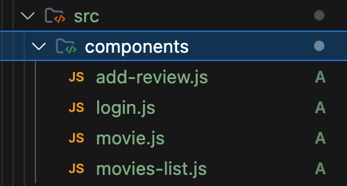
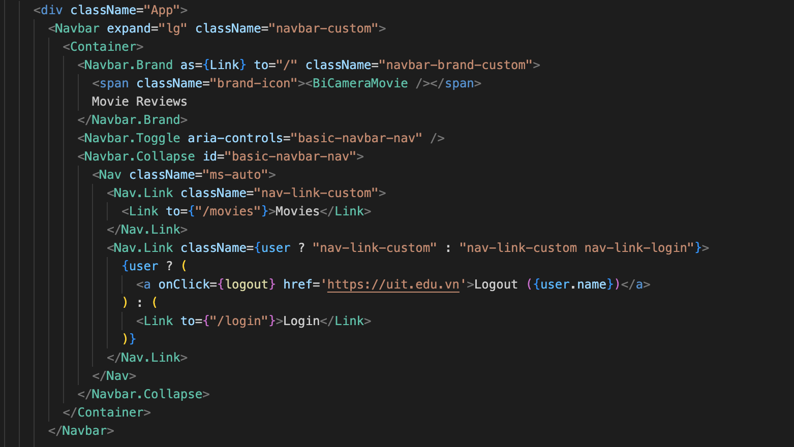
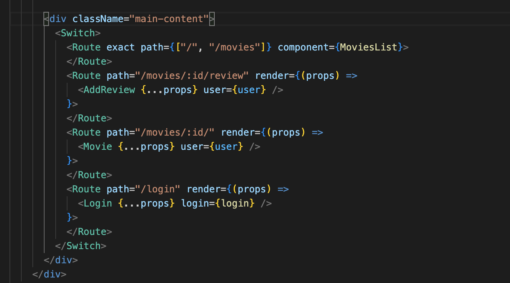
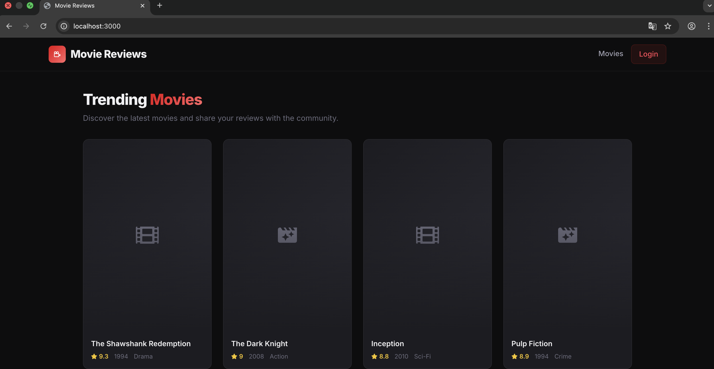
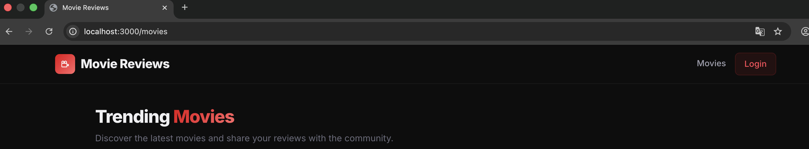
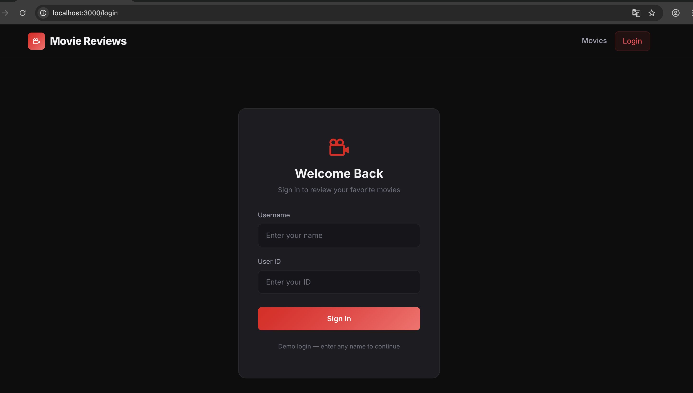
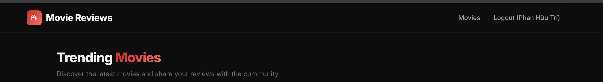

# LAB 04 - Khởi tạo Frontend và Routing cho ứng dụng Movie Reviews

## 1. Thông tin báo cáo
- Môn học: Kỹ thuật phát triển hệ thống web
- Bài thực hành: Lab 04
- Sinh viên: Phan Hữu Trí
- MSSV: 23521647
- Lớp: IE213.Q21
- Giảng viên hướng dẫn: ThS. Võ Tấn Khoa

## 2. Mục tiêu bài lab
Bài Lab 04 tập trung vào việc thiết lập phía giao diện người dùng (Frontend) sử dụng thư viện React cho nền tảng ứng dụng Movie Reviews. 

Sau khi hoàn thành, hệ thống đạt được các yêu cầu chính sau:
- Khởi tạo thành công template dự án dựa trên `create-react-app`.
- Thành thạo sử dụng các package UI như `bootstrap` và `react-bootstrap`.
- Xây dựng hoàn chỉnh thanh Navigation Header Bar có khả năng lưu giữ trạng thái đăng nhập của người dùng.
- Thiết lập định tuyến linh hoạt cho Single Page Application (SPA) với thư viện `react-router-dom`.
- Nâng cấp thiết kế giao diện (Dark Theme) tạo trải nghiệm người dùng hiện đại và chuyên nghiệp (Mở rộng ngoài yêu cầu gốc).


## 3. Hướng dẫn cài đặt và chạy dự án
Di chuyển vào thư mục frontend:

```bash
cd Lab04/frontend
```

Cài đặt các thư viện (dependencies) cần thiết:

```bash
npm install
```

Khởi động server phát triển:

```bash
npm start
```

Nếu thành công, trình duyệt sẽ tự động mở và chạy ứng dụng tại địa chỉ:
```text
http://localhost:3000
```

## 4. Quá trình thực hiện

### 4.1 Khởi tạo dự án
Sử dụng dòng lệnh `npx create-react-app frontend` để tạo thư mục chứa toàn bộ mã nguồn React. Môi trường phát triển bao gồm đầy đủ Webpack, Babel.

Đồng thời, cài đặt các packages yêu cầu: `react-router-dom@5`, `bootstrap`, `react-bootstrap`, `react-icons`.

### 4.2 Xây dựng cấu trúc Components
Bên trong thư mục `src/`, thư mục con `components` được tạo ra để đảm nhận từng trang cụ thể, phục vụ việc định tuyến:
- `movies-list.js`: Màn hình trang chủ hiển thị danh sách các thẻ bài phim (Grid Layout).
- `movie.js`: Trang hiển thị thông tin chi tiết một bộ phim và các dòng bình luận (Review).
- `add-review.js`: Form cho phép người dùng đóng góp nhận xét (yêu cầu trạng thái đã đăng nhập).
- `login.js`: Trang xử lý xác thực tên người dùng (lưu qua React state).
- 

### 4.3 Xây dựng Navigation Bar
Thanh điều hướng được lấy từ Component `Navbar` của React-Bootstrap.
- Tuỳ biến Logo với tên "**Movie Reviews**" và icon cuộn phim trắng xuyên suốt.
- Quản lý trạng thái bằng Hook `useState`: `[user, setUser] = React.useState(null)`.
- Khi chưa đăng nhập: Nút Login hiện ra điều hướng sang trang `/login`. 
- Khi đã đăng nhập: Navbar hiện chữ "Logout (Tên người dùng)" và cung cấp phương thức hàm `logout()` cập nhật state về `null`. 


### 4.4 Thiết lập định tuyến Routes
Cấu hình App.js được bọc trong thẻ `<BrowserRouter>` từ file `index.js`. 
Bên trong file `App.js`:
```jsx
<Switch>
  <Route exact path={["/", "/movies"]} component={MoviesList} />
  <Route path="/movies/:id/review" render={(props) => <AddReview {...props} user={user} />} />
  <Route path="/movies/:id/" render={(props) => <Movie {...props} user={user} />} />
  <Route path="/login" render={(props) => <Login {...props} login={login} />} />
</Switch>
```


### 4.5 Cải tiến UI/UX (Tính năng mở rộng)
- Em đã nâng cấp một chút UI để web trông đẹp hơn, em muốn có sự chỉnh chu và đầu tư khi thực hiện bài Lab, nó sẽ giúp em thực hành và học hỏi được thêm nhiều kiến thức.

## 5. Kết quả đạt được
Sau bài thực hành Lab04:
- Triển khai thành công khung ứng dụng React có khả năng mở rộng.
- Nắm vững kiến thức truyền state của `user` xuyên suốt các Component qua Props trong môi trường `<Route>`.
- SPA chuyển hướng trang lập tức mà không cần tải lại trình duyệt.
- Thiết kế giao diện hoàn thiện, sẵn sàng để ráp nối với Backend API (`axios`) cho Lab05.
- 
- Đây là giao diện trang chủ em đã nâng cấp một chút cho đẹp hơn.
- 
- 
- Giao diện trang login em chỉ làm demo nên chưa có chức năng đăng nhập thật.

- Sau khi login, nút login sẽ chuyển thành Log out
