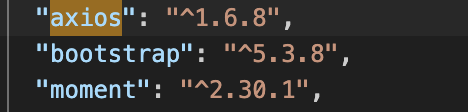
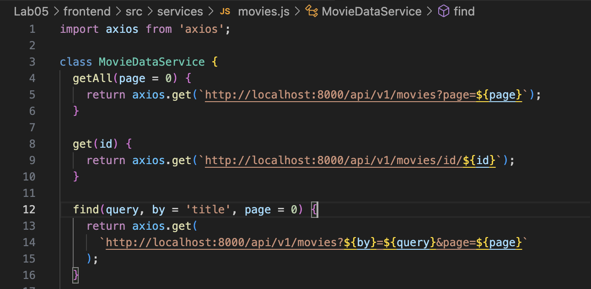
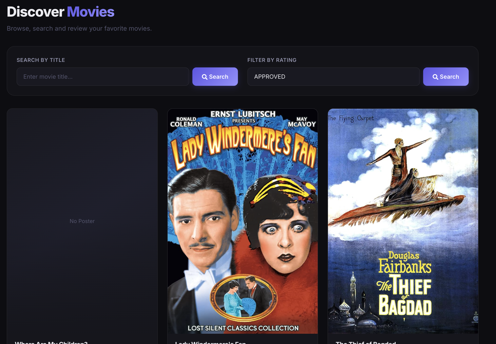
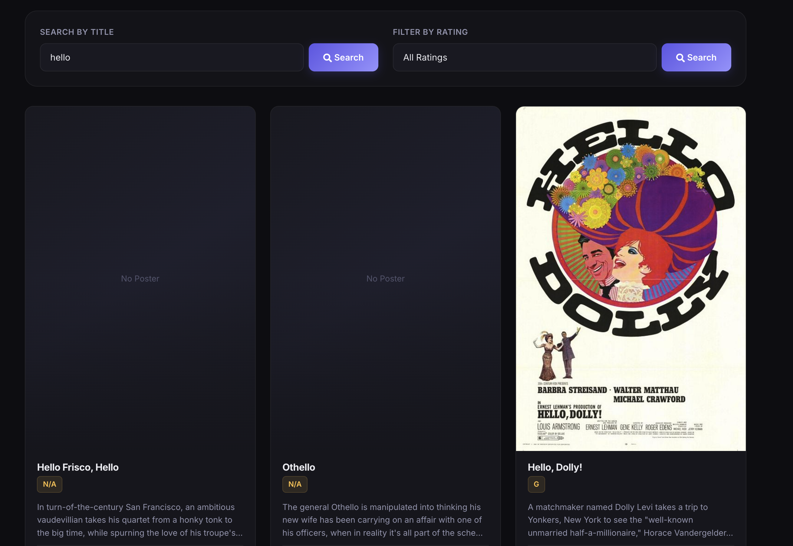
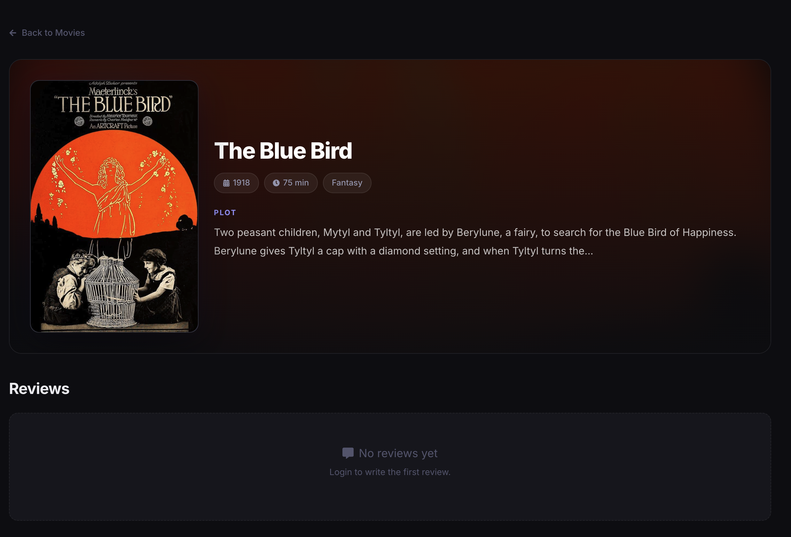
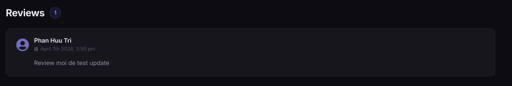
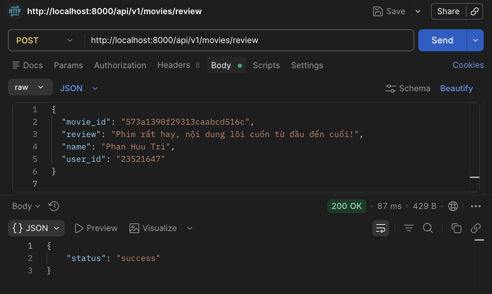
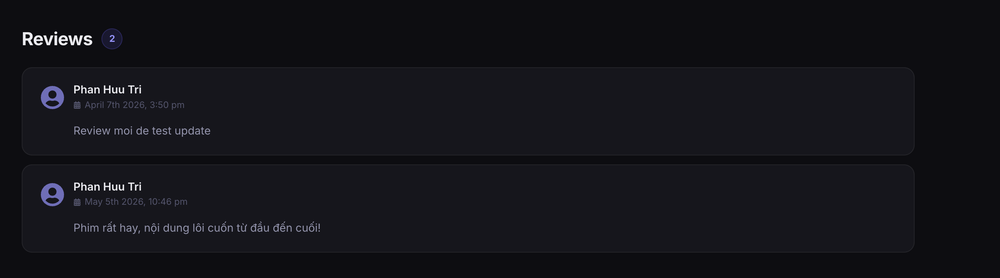

# Lab05 (Xây dựng Frontend với ReactJS)

## 1. Thông tin sinh viên

| Họ tên                   | MSSV               | Lớp                |
| :------------------------- | :----------------- | :------------------ |
| **Phan Hữu Trí** | **23521647** | **IE213.Q21** |

## 2. Thông tin môn học

- Môn học: **IE213.Q21 - Kỹ thuật phát triển hệ thống web**

## 3. Danh sách lab

- **Lab05: Xây dựng Frontend với ReactJS**

## 4. Mô tả ngắn gọn Lab05

Lab05 kế thừa backend và frontend từ các bài trước, tập trung chuẩn hóa việc kết nối từ frontend tới backend bằng **axios**, tổ chức lớp dịch vụ `MovieDataService`, xây dựng form tìm kiếm movie theo `title` và `rating`, hiển thị danh sách movie bằng `Card` của React-Bootstrap, hiển thị trang chi tiết movie cùng danh sách review, và định dạng thời gian review bằng `momentjs`.

## 5. Cách chạy chương trình

1. Chạy backend:

```bash
cd Lab05/backend
npm install
```

2. Cấu hình `.env` cho backend:

```env
PORT=8000
MOVIEREVIEWS_DB_URI=<mongodb-atlas-uri>
MOVIEREVIEWS_NS=sample_mflix
```

3. Khởi động backend:

```bash
npm start
```

4. Chạy frontend ở terminal khác:

```bash
cd Lab05/frontend
npm install
npm start
```

5. Mở trình duyệt:

- Frontend: `http://localhost:3000`
- Backend API: `http://localhost:8000/api/v1/movies`

---

## 6. Chi tiết thực hiện theo từng câu

### Bài 1: Kết nối tới Backend

#### 1.1 Cài đặt axios cho dự án hiện tại
- Đã chạy lệnh `npm install axios moment`
- Kết quả: `axios` được dùng để fetch API, `moment` dùng định dạng thời gian.
- Ảnh minh hoạ:



#### 1.2 Tạo lớp dịch vụ `MovieDataService`
- Khởi tạo file `src/services/movies.js`.
- Export class `MovieDataService` làm module dùng chung.
- Ảnh minh hoạ:


#### 1.3 Tạo các lời gọi dịch vụ tới backend
- Viết 6 hàm chính tương ứng với API backend: `getAll(page)`, `get(id)`, `find(query, by, page)`, `createReview(data)`, `updateReview(data)`, `deleteReview(id, userId)`, `getRatings()`.
- Các hàm đều gọi API qua cổng `http://localhost:8000/api/v1/movies`.

### Bài 2: Xây dựng MoviesList Component

#### 2.1 Tạo các biến trạng thái
- Sử dụng hooks `useState` khởi tạo: `movies`, `searchTitle`, `searchRating`, `ratings` (mặc định ['All Ratings']).

#### 2.2 Tạo `retrieveMovies()` và `retrieveRatings()`
- Tích hợp 2 hàm vào bên trong vòng đời component bằng hook `useEffect` chạy lần đầu khi trang load.

#### 2.3 Tạo 2 search form theo title và rating
- Tạo UI đẹp mắt cho ô nhập liệu, gán sự kiện `onChange` tương ứng cho `onChangeSearchTitle` và `onChangeSearchRating`.
- Ảnh minh hoạ:


#### 2.4 Hiển thị các movie bằng `Card`
- Map qua mảng dữ liệu `movies` hiển thị thẻ `<Card>`, sử dụng Grid Layout của React-Bootstrap (`Col`, `Row`).
- Xử lý mượt mà khi Poster không tồn tại: thay thế inline fallback tránh gọi dịch vụ bên ngoài bị chết (`via.placeholder.com`).
- Ảnh minh hoạ:


#### 2.5 Hiện thực tìm phim theo `Title` hoặc `Rating`
- Viết các phương thức logic cho sự kiện onClick của nút Search.
- Giao diện cung cấp Empty State ("No movies found") báo lỗi thân thiện nếu data rỗng.
- Ảnh minh hoạ:
### Tìm theo Rating:

### Tìm theo Title:

### Bài 3: Hiển thị thông tin trang Movie

#### 3.1 Tạo state `movie`
- Quản lý trạng thái: `{ id: null, title: "", rated: "", reviews: [] }`.

#### 3.2 Xây dựng `getMovie()`
- Sử dụng `useParams()` từ Router (hoặc props.match.params.id) gọi API `MovieDataService.get()`.

#### 3.3 Trang trí JSX cho trang chi tiết movie
- Triển khai "Hero Section" chuyên nghiệp: Hình nền bị làm mờ (backdrop blur), poster có viền sáng, tags rõ ràng.
- Giao diện có nút điều hướng, có điều kiện ẩn/hiện nút "Add Review" khi chưa Login.


### Bài 4: Hiển thị danh sách review

#### 4.1 Hiển thị review tương ứng cho từng phim
- Map dữ liệu review hiển thị thành từng thẻ Card riêng biệt dưới mục nội dung. Cấu trúc HTML phân cấp đẹp mắt, có Avatar ảo và Icon rành mạch.
- Ảnh minh hoạ:


#### 4.2 Thêm, sửa, xoá review
- Phát triển component `<AddReview>` đảm nhận form thêm mới và cập nhật, truyền state qua thẻ `<Link>`.
- Chức năng sửa/xoá chỉ xuất hiện khi `props.user.id` khớp với `review.user_id`.
- Ảnh minh hoạ: Test bằng Postman để thêm review

- Kết quả thêm review thành công:


#### 4.3 Điều chỉnh cách hiển thị giờ với `momentjs`
- Ứng dụng `moment(review.date).format('MMMM Do YYYY, h:mm a')` xử lý format timestamp dễ nhìn hơn.
- Ảnh minh hoạ: 


